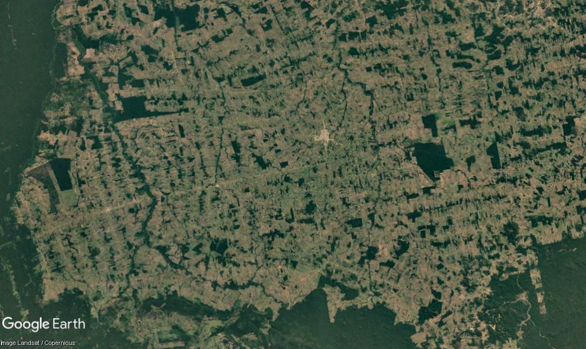
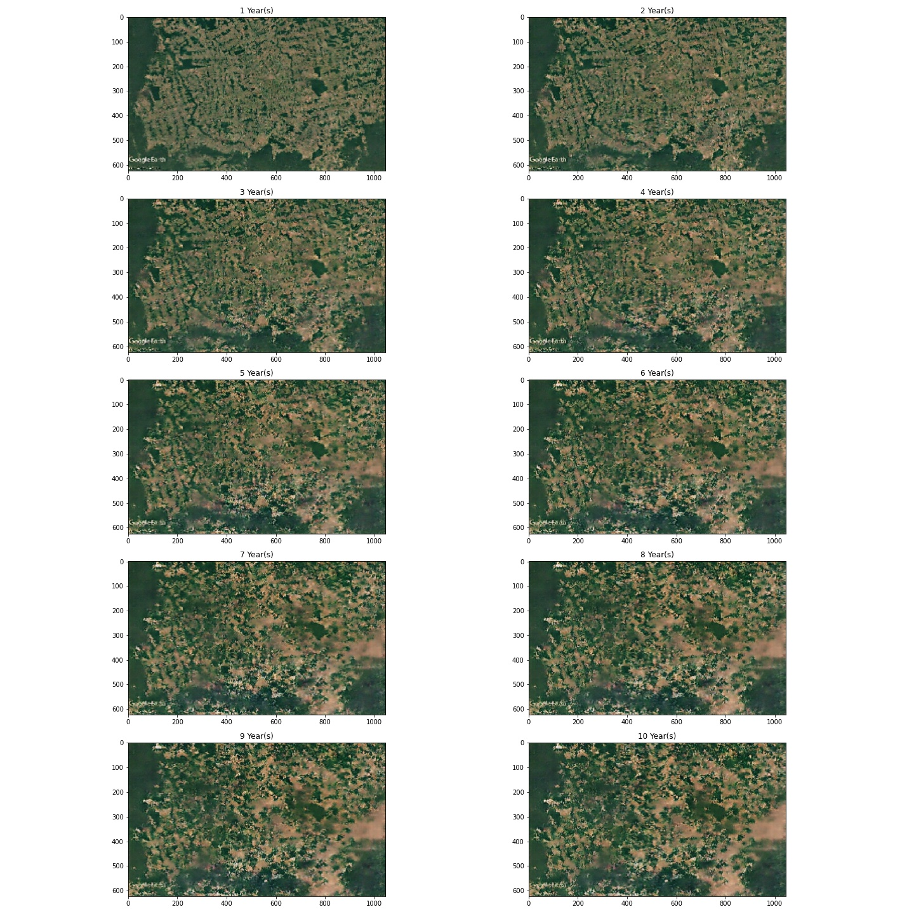

# Forecast

This project was made for HackTech 2021 by Elise Liu and Archie Shahidullah. It uses a pix2pix conditional GAN
neural network to forecast deforestation in the Amazon rainforest. This model
is in `pix2pix_train.ipynb`. The following command runs the flask app, where you can select a region from a map and forecast 5 yers into the future of what deforestation may look like.

```
python main.py
```

Note we do not include the folder `training_checkpoints` which has the 
650 Mb model weights file or the Mapbox `token.txt` file. 

Here is a sample image to predict on.



This is the forecast returned by the model.


